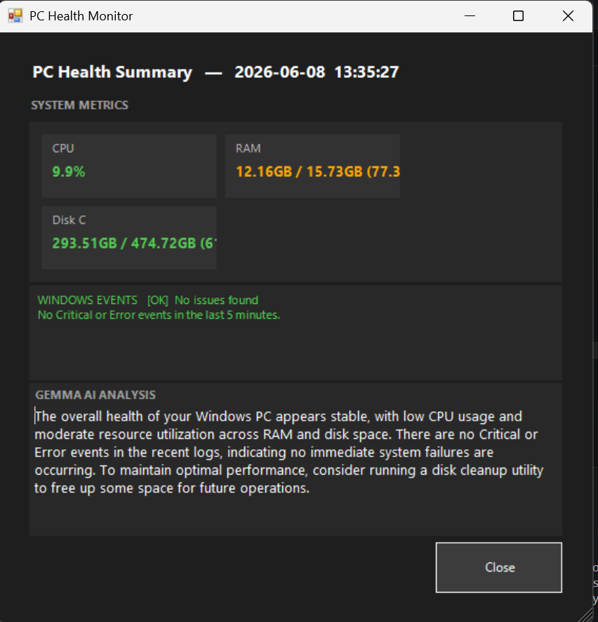
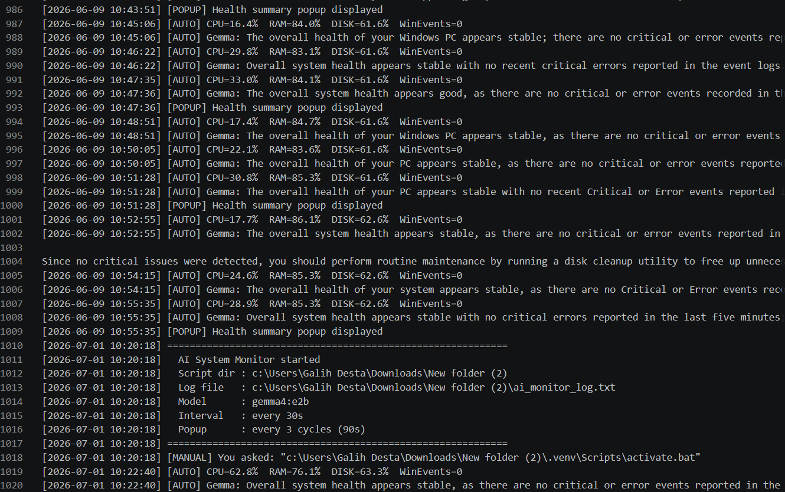

# Local-Ai-Pc-Health-Monitor
An autonomous, fully offline PC health monitoring system powered by a locally running Gemma AI model. Monitors CPU, RAM, disk, and Windows Event Logs every 30 seconds and delivers plain-language health summaries, no internet required.

Key Features
**Fully Offline AI:** Runs gemma4:e2b locally via Ollama — no data leaves the device, no internet needed.
**Autonomous Monitoring:** Collects system metrics and Windows Event Log errors every 30 seconds automatically.
**AI Health Summaries:** Gemma interprets all data together and gives a plain-language health verdict with a concrete recommendation.
**Desktop Popup:** Dark-themed Windows Forms popup appears every 90 seconds with live metrics and AI analysis.
**Persistent Log File:** Every cycle is timestamped and saved to ai_monitor_log.txt for long-term health tracking.
**Manual Prompt:** Ask Gemma any question from the terminal while the auto-monitor keeps running in the background.

Tools Used
**Python 3.13:** Core scripting, data collection, AI communication, threading, and output delivery.
**Ollama + gemma4:e2b:** Local AI runtime serving Google DeepMind's 2B-parameter edge model offline.
**psutil:** Reads real-time CPU, RAM, and disk usage from the operating system.
**PowerShell + subprocess:** Queries Windows Event Log via Get-WinEvent for Critical and Error events.
****PowerShell Windows Forms:** Builds the responsive dark-themed desktop popup — no extra pip install needed.
**threading:** Runs the auto-loop and manual prompt listener simultaneously without blocking each other.
**Virtual Environment (.venv):** Isolates dependencies for consistent execution including via Task Scheduler.

Project Previews
**1. Live Desktop Popup**
The automated popup appearing every 90 seconds with color-coded metrics and full Gemma AI analysis.
CPU: 9.9% ✅ | RAM: 77.3% 🟠 | Disk: 61.9% ✅ | Windows Events: No issues found
Gemma flagged moderate RAM usage and recommended running a disk cleanup utility as routine maintenance.

**2. Autonomous Log File — 1000+ Entries**
The ai_monitor_log.txt file showing 1000+ timestamped entries logged across multiple days without any manual input, confirming fully autonomous operation. Each cycle logs raw metrics and Gemma's full health assessment. Popup triggers and manual prompt usage are also recorded — line 1018 shows a user question sent while the auto-loop ran uninterrupted in the background.

